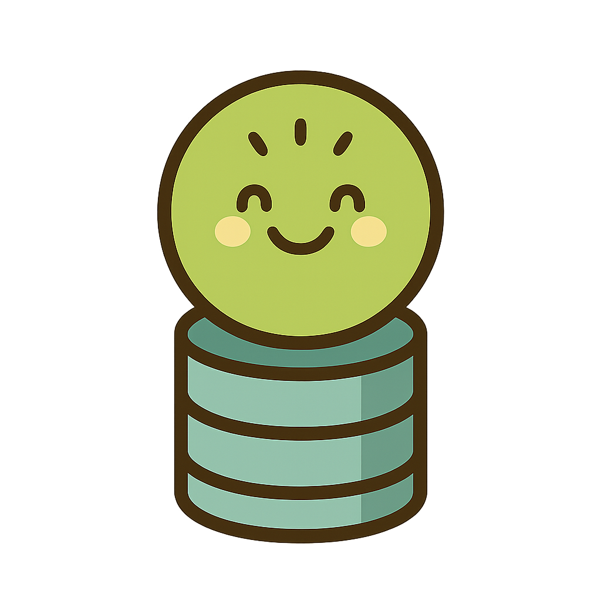

  

<h1 align="center">kiwi — a tiny key–value storage</h1>

  <b>Status: Work in Progress — not production-ready</b>

---

## What is kiwi?

Kiwi is a simple, educational key–value store project in Go.

> Why “Kiwi”?
> A playful nod to “KV” (key–value). Spoken in English (“kay-vee”), it sounds a bit like the german fruit “Kiwi” — and thus a friendly fruit mascot was born.

---

## Roadmap

- v0.1
    - [x] In-memory KV store
    - [x] set/get/delete
    - [ ] Append-only active log and crash recovery
    - [ ] Simple API

---

## Contributing

Contributions are welcome! Please:
- Open an issue to discuss changes
- Use clear commit messages
- Run go fmt / lint before committing

---

## License

MIT [LICENSE](LICENSE)